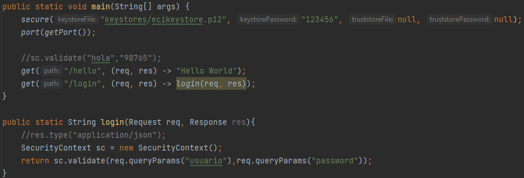
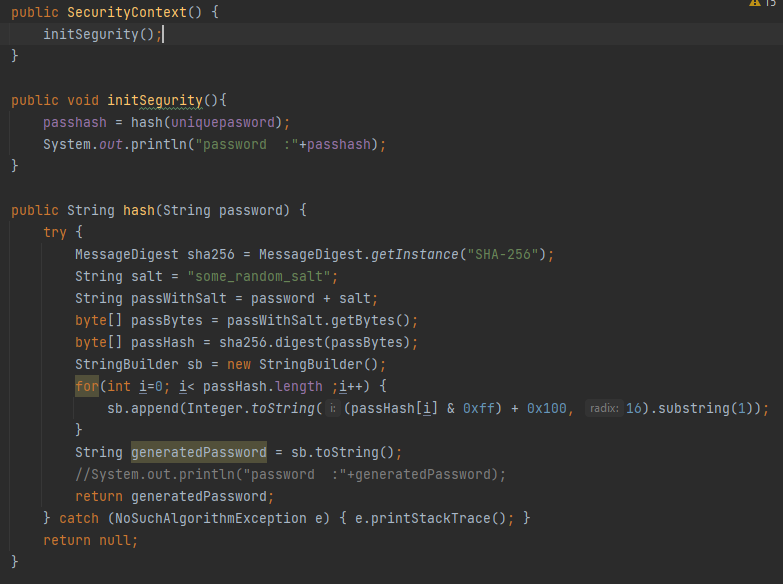
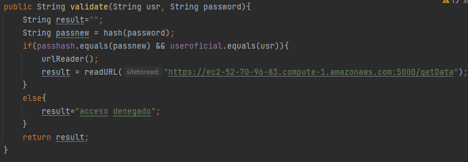
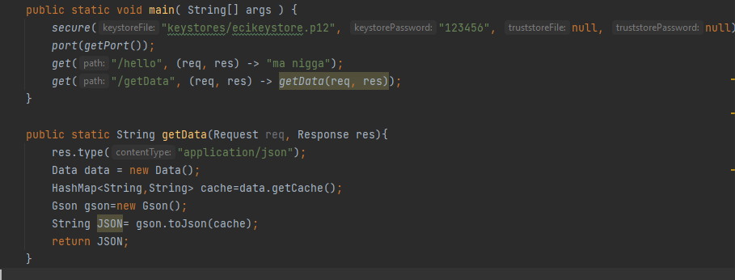
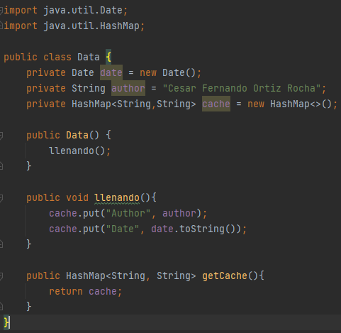
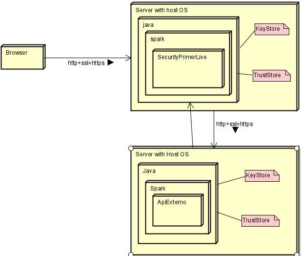

# Escuela Colombiana de Ingeniería Julio Garavito
## Aplicación segura
## 👤 Autor
César Fernando Ortiz Rocha
## Descripción general

En este laboratorio se realizó un prototipo de aplicación segura haciendo uso del protocolo https, dicha aplicación cuenta con dos servicios, uno de los servicios es el de login el cual se va a encargar de recibir un usuario y una contraseña para autenticarse, una vez autenticado se diriguirá al otro servicio el cual tiene los datos almacenados, traera esos datos y los mostrará.

## Desarrollo de los servicios

### Servicio login

En este servicio cuenta con dos endpoints un **(get)/hello** el cual cumple con la función de verificar que el servicio funciona y un **(get)/login** el cual se encarga de recibir el usuario y contraseña por el path.

Tambien se puede ver el metodo **login** el cual se encarga de sacar los parametros puestos en el path haciendo uso de request.queryParams() y enviar estos para que sean verificados.

En el contructor de SecurityContext se realiza la implementación del hash de la contraseña ya registrada

Aqui se puede apreciar el metodo en el que se validan los datos que se registraron a la hora de hacer el logeo, si los datos concuerdan entonces se procedera a realzar la confianza del documento con la ip del servicio que trae los datos, de lo contrareo saldra acceso denegado.

### Servicio login

En este servicio cuenta con dos endpoints un **(get)/hello** el cual cumple con la función de verificar que el servicio funciona y un **(get)/getData** que se encarga de traer los datos almacenados en este servicio

En esta clase es donde se crean y guardan los datos en un hash map que luego van a ser llamados, dicho hash map contiene el author del proyecto y la fecha actual.

## Diagrama de despliegue 

## Incorporar nuevos servicios en la Arquitectura de seguridad

Para incorporar nuevos servicios a la arquitectura simplemente se debe generar el documento de seguridad respectivo en dicho servicio, haciendo que corra en https y pasandole el documento de confianza al servicio de login para que este pueda ingresar, ademas de generar el endpoint respectivo para saber cual debe ser el llamado que el servicio login debe hacer una vez el usuario se ha autenticado

## Video Experimental

